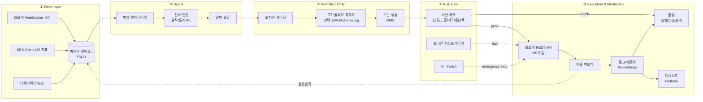
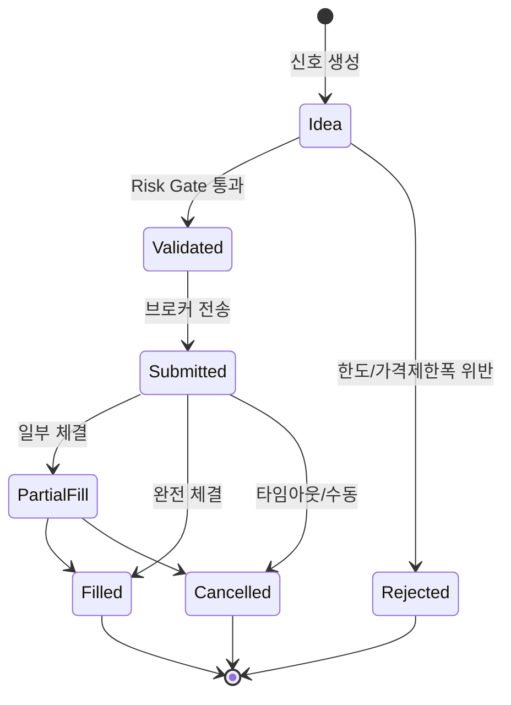
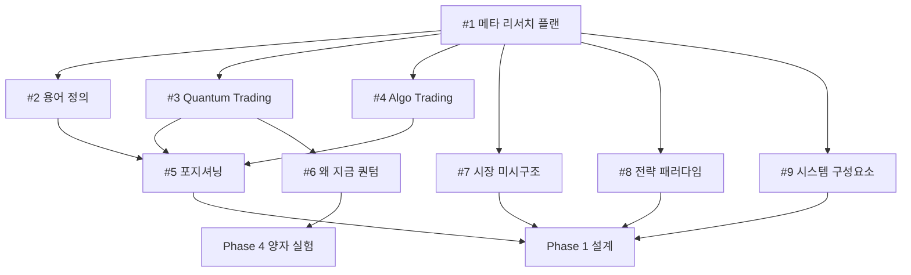

# 자동매매 프로그램 구현을 위한 선행 리서치 + 구현 플랜 초안

> Issue #1 — Phase 0 메타 리서치. 이후 Phase 1+ 이슈의 AC는 이 플랜에서 파생된다.
> 작성일: 2026-04-13 / 범위: 개인 투자자가 KRX + (선택적으로) 양자 컴포넌트를 붙여 자동매매를 만들기 위한 선행 조사 지도.

---

## 0. 요약 (TL;DR)

- "자동매매"는 **데이터 → 신호 → 주문 → 리스크 → 모니터링** 5단계 파이프라인이며, 이 뼈대에 전략 패러다임(규칙기반/통계/ML/양자)이 얹힌다.
- 개인 투자자 현실 범위는 **저빈도~중빈도 (분봉~일봉)** 이며, HFT는 레이턴시·코로케이션·비용 장벽으로 현실적 타겟이 아니다.
- 한국에서는 **한국투자증권 KIS Open API** 와 **키움 REST API** 가 주력 자동매매 채널. KRX Open API는 시세/지표 보조용.
- 양자 컴포넌트는 2026년 기준 **포트폴리오 최적화(QAOA/Annealing)** 에 한정한 "오프라인 실험 모듈" 수준이 현실적. 실시간 주문 결정에는 넣지 않는다.
- Phase 1에서는 **규칙기반 + 통계적 요인 모델**로 MVP를 만들고, 백테스트·워크포워드 검증을 통과한 뒤에만 실계좌로 옮긴다.

---

## 1. 리서치 주제 · 자료 · 결정 포인트 목록 (총 22항목)

분류별로 묶었다. 각 항목은 "무엇을 조사하는가 / 어떤 결정을 해야 하는가"를 담는다.

### A. 용어 · 범위 정의 (프로젝트 정체성 확정)

| # | 주제 | 핵심 결정 포인트 | 담당 이슈 |
|---|---|---|---|
| 1 | Quant vs Quantum 용어 정의 | 프로젝트가 어느 쪽인지 1문장 확정 | #2 |
| 2 | Quantum Trading의 실체 | 양자 컴포넌트를 넣을지/뺄지 | #3, #6 |
| 3 | Algorithmic Trading 정의·분류 | HFT/중빈도/저빈도 중 타겟 층 결정 | #4 |
| 4 | 3자 포지셔닝 (Algo/Quant/Quantum) | 본 프로젝트의 벤 다이어그램 위치 | #5 |

### B. 시장 · 인프라 기초

| # | 주제 | 핵심 결정 포인트 | 담당 이슈 |
|---|---|---|---|
| 5 | KRX 시장 미시구조 (호가·체결·유동성) | 슬리피지·체결 모델 파라미터 | #7 |
| 6 | KRX 특수 제도 (가격제한폭·단일가·VI·거래세) | 주문 시뮬레이션 제약 | #7 |
| 7 | 브로커 API 선택 (KIS / 키움 / 기타) | 1차 채널 확정 | 신규 이슈 제안 |
| 8 | 실시간 데이터 소스 (웹소켓/REST 레이트리밋) | 폴링 주기·이벤트 처리 설계 | 신규 이슈 제안 |

### C. 시스템 아키텍처

| # | 주제 | 핵심 결정 포인트 | 담당 이슈 |
|---|---|---|---|
| 9 | 파이프라인 5단계 컴포넌트 표준화 | 각 컴포넌트의 책임·인터페이스 | #9 |
| 10 | 이벤트드리븐 vs 벡터라이즈드 백테스트 | 백테스트 엔진 선택 | 신규 이슈 제안 |
| 11 | 오픈소스 프레임워크 비교 (LEAN/Zipline/FinRL/Backtrader/Nautilus) | MVP 베이스 결정 | 신규 이슈 제안 |
| 12 | 저장소 (파케이/TSDB/로컬 SQLite) | 데이터 레이크 스키마 | 신규 이슈 제안 |

### D. 전략 · 모델링

| # | 주제 | 핵심 결정 포인트 | 담당 이슈 |
|---|---|---|---|
| 13 | 전략 패러다임 개괄 | Phase 1에서 쓸 1~2개 후보 | #8 |
| 14 | 백테스트 방법론 (walk-forward, purged K-fold) | 검증 프로토콜 고정 | 신규 이슈 제안 |
| 15 | 오버피팅 방지 (데이터 스누핑·survivorship bias) | 통계 가드레일 | 신규 이슈 제안 |
| 16 | 피처·알파 소스 (기술지표/팩터/대체데이터) | 알파 유니버스 초안 | 신규 이슈 제안 |

### E. 리스크 · 실행 품질

| # | 주제 | 핵심 결정 포인트 | 담당 이슈 |
|---|---|---|---|
| 17 | 포지션 사이징·켈리·변동성 타겟팅 | 자본 배분 규칙 | 신규 이슈 제안 |
| 18 | 스톱로스·드로우다운 캡·서킷브레이커 | 런타임 리스크 한도 | 신규 이슈 제안 |
| 19 | 실행 알고리즘 (TWAP/VWAP/마켓) | 주문 집행 정책 | 신규 이슈 제안 |

### F. 운영 · 컴플라이언스

| # | 주제 | 핵심 결정 포인트 | 담당 이슈 |
|---|---|---|---|
| 20 | 모니터링·로깅·알림 (Prometheus/Grafana/Loki) | 관측성 스택 | 신규 이슈 제안 |
| 21 | Kill switch · 재해 복구 | 수동 개입 프로토콜 | 신규 이슈 제안 |
| 22 | 세금·신고·자금출처 (KR 개인 기준) | 연말 정산 플로우 | 신규 이슈 제안 |

> 최소 15개 기준을 충족(22개). B~F는 Phase 1+ 이슈 후보.

---

## 2. 구현 접근 플랜 초안 — 파이프라인

### 2.1 5-Stage 파이프라인

### 2.2 스테이지별 책임 · 기술 후보

| 스테이지 | 책임 | 기술 후보 | Phase 1 기본값 |
|---|---|---|---|
| ① Data | 수집·정규화·저장 | KIS WebSocket, pykrx, Parquet | pykrx + Parquet 로컬 |
| ② Signal | 피처·전략·알파 | pandas, polars, scikit-learn | 규칙기반 + 간단 통계 |
| ③ Portfolio | 사이징·최적화·주문생성 | cvxpy, (선택) Qiskit Finance | cvxpy 평균-분산 |
| ④ Risk | 사전/실시간 체크 | 자체 구현 + 룰 DSL | YAML 룰 + 파이썬 가드 |
| ⑤ Execution | 주문·모니터링 | KIS REST, Prometheus, Grafana | KIS 모의계좌 → 실계좌 |

### 2.3 데이터·주문 상태 머신

### 2.4 Phase별 로드맵

| Phase | 기간(예시) | 목표 | 산출물 |
|---|---|---|---|
| Phase 0 (현재) | 2주 | 리서치·용어·포지셔닝 | #1~#9 문서 |
| Phase 1 | 4~6주 | 백테스트 MVP (규칙 기반) | cli 백테스트, 단일 전략, 모의계좌 연결 |
| Phase 2 | 4주 | 리스크·실행 강화 | 서킷브레이커, 관측성, 실계좌 소액 운용 |
| Phase 3 | 4주 | 통계/ML 전략 추가 | 멀티 팩터, 워크포워드 자동화 |
| Phase 4 (선택) | 4주+ | 양자 포트폴리오 최적화 실험 | QAOA 오프라인 모듈, 고전 대비 벤치마크 |

---

## 3. 기존 이슈 #2~#9 매핑 표

각 이슈가 플랜 어느 결정을 지원하는지.

| 이슈 | 제목 | 지원하는 결정 | 파이프라인 스테이지 | 블로킹 대상 |
|---|---|---|---|---|
| #2 | Quant vs Quantum 용어 | 프로젝트 정체성 1문장 | 전체 | #5 |
| #3 | Quantum Trading이란 | 양자 컴포넌트 유무 1차 판단 | ③ Portfolio (선택) | #5, #6 |
| #4 | Algorithmic Trading 정의 | HFT/중/저빈도 타겟 | 전체 | #5, #8 |
| #5 | Algo/Quant/Quantum 포지셔닝 | "본 프로젝트는 ___" 확정 | 전체 | Phase 1 설계 |
| #6 | 왜 지금 퀀텀인가 | 양자 모듈 포함 여부 최종 결정 | ③ Portfolio (선택) | Phase 4 착수 |
| #7 | KRX 시장 미시구조 | 슬리피지 모델·주문 제약 | ①, ④, ⑤ | 백테스트 엔진 설계 |
| #8 | 전략 패러다임 개괄 | Phase 1 전략 후보 1~2개 | ② Signal | Phase 1 착수 |
| #9 | 시스템 구성요소 개괄 | 컴포넌트 다이어그램·인터페이스 | 전체 | Phase 1 설계 |

### 3.1 이슈 의존 그래프

---

## 4. Phase 2+ 후속 리서치 제안 (신규 이슈 후보)

아래는 기존 #2~#9에 포함되지 않은 결정 포인트. 각각 별도 이슈로 분리 권장.

1. **브로커 API 비교 · 선정** — KIS vs 키움 vs LS증권 REST/WebSocket 스펙·레이트리밋·수수료·모의계좌 비교. (섹션 1의 #7)
2. **데이터 레이크 스키마 설계** — OHLCV/호가/체결/팩터 파케이 파티셔닝 규약.
3. **백테스트 엔진 선택** — Zipline-reloaded / Backtrader / LEAN(로컬) / Nautilus Trader / 자체 구현의 트레이드오프.
4. **백테스트 검증 프로토콜** — walk-forward, purged K-fold, 데이터 스누핑 방지 체크리스트.
5. **피처·알파 소스 카탈로그** — 기술지표/팩터/대체데이터(뉴스·체결강도) 유니버스.
6. **리스크 룰 DSL** — YAML 기반 한도 정책 스키마 (per-trade/per-day/per-portfolio).
7. **실행 알고리즘** — TWAP/VWAP/시장가/지정가 분배 정책과 KRX 단일가 구간 처리.
8. **관측성 스택** — Prometheus 메트릭 네이밍, Grafana 대시보드 패널, Loki 로그 라우팅, 알림 채널.
9. **Kill Switch & DR** — 수동 중단·자동 중단 트리거, 포지션 청산 런북.
10. **세금·회계 자동화** — 체결 내역 → 양도세 추정, 연말 신고 자료 생성.
11. **양자 PoC 설계(선택)** — Qiskit Finance QAOA를 사용한 50종목 포트폴리오 최적화 벤치마크 (고전 대비).
12. **LLM 에이전트 레이어(탐색)** — 2025년 등장한 "Agentic Trading" 아키텍처(Planner/Risk/Alpha/Execution Agent) 적용 타당성.

---

## 5. 핵심 결정 선택지 비교 (의사결정 지원)

### 5.1 백테스트 엔진

| 후보 | 언어 | 이벤트드리븐 | 라이브 주문 | 난이도 | 권장 용도 |
|---|---|---|---|---|---|
| Zipline-reloaded | Python | ✅ | ❌ (구 Quantopian) | 중 | 개념 학습·레거시 |
| Backtrader | Python | ✅ | 일부 | 저 | 빠른 프로토타입 |
| LEAN (QuantConnect) | C#/Py | ✅ | ✅ | 고 | 프로덕션급 |
| FinRL | Python | RL 환경 | ❌ | 중 | 강화학습 연구 |
| Nautilus Trader | Rust/Py | ✅ | ✅ | 고 | 결정론적 프로덕션 |

### 5.2 브로커 API (KR 개인)

| 브로커 | 주문 API | 실시간 시세 | 모의계좌 | 특징 |
|---|---|---|---|---|
| 한국투자증권 KIS | REST/WebSocket | ✅ | ✅ | 공식 GitHub 샘플, 2022년 국내 최초 Open API |
| 키움증권 | REST (구 OpenAPI+) | ✅ | ✅ | 개인 유저 가장 많음, .NET/Python 래퍼 풍부 |
| LS증권 | REST/xingAPI | ✅ | ✅ | 파생 강세 |

> **MVP 권장**: KIS Open API (공식 저장소·샘플이 LLM 자동화 환경까지 염두). 단, TLS 1.0/1.1 지원 종료(2025-12-12) 후 TLS 1.2+ 필수.

### 5.3 전략 패러다임

| 패러다임 | 데이터 요구량 | 검증 가능성 | 진입장벽 | Phase 1 적합도 |
|---|---|---|---|---|
| 규칙기반 (이평·볼린저·브레이크아웃) | 저 | 높음 | 저 | ★★★ |
| 통계적 (평균회귀·페어·팩터) | 중 | 중 | 중 | ★★ |
| ML (트리·LSTM·RL) | 고 | 낮음 | 고 | ★ |
| 양자 (QAOA/Annealing) | — (최적화 문제) | NISQ 한계 | 고 | — (Phase 4) |

---

## 6. 리스크 프레임 (초안)

| 레벨 | 한도 예시 | 조치 |
|---|---|---|
| per-trade | 자본의 1~2% | 자동 주문 거절 |
| per-day | 자본의 3% 손실 | 당일 신규 진입 중단 |
| portfolio | 피크 대비 -15% | 전체 Kill Switch, 수동 재개 |
| latency | p95 > 500ms | 주문 보류, 알림 |
| error rate | 5분간 5건 이상 주문 실패 | 자동 중단 |

---

## 7. 결론 · 다음 단계

- **본 프로젝트의 1문장 정의(잠정)**: "KRX 대상 저/중빈도 **알고리즘 트레이딩 시스템**이며, 포트폴리오 최적화 레이어에 한해 **양자 컴퓨팅 실험 모듈**을 선택적으로 부착한다." (#5에서 확정)
- **즉시 착수 권장 이슈**: #7(시장 미시구조), #9(시스템 구성요소). 두 문서가 Phase 1 설계를 언락함.
- **병렬 진행 가능**: #2·#3·#4·#8은 독립적으로 리서치 가능.
- **Phase 4 양자 모듈은 스코프 프리즈** — Phase 1~3이 실계좌 검증을 통과하기 전까지 실험 브랜치에만 둔다.

---

## 출처

### 아키텍처 · 파이프라인
- [QuantInsti — Automated Trading Systems: Design, Architecture & Low Latency](https://www.quantinsti.com/articles/automated-trading-system/)
- [Turing Finance — Algorithmic Trading System Architecture (Stuart Gordon Reid)](https://www.turingfinance.com/algorithmic-trading-system-architecture-post/)
- [arXiv:2512.02227 — Orchestration Framework for Financial Agents: From Algorithmic Trading to Agentic Trading](https://arxiv.org/html/2512.02227v1)
- [DEV.to — Algorithmic Trading Architecture and Quants: BlackRock & Tower Research Case Studies](https://dev.to/nashetking/algorithmic-trading-architecture-and-quants-a-deep-dive-with-case-studies-on-blackrock-and-tower-research-55ao)
- [GitHub — nautechsystems/nautilus_trader](https://github.com/nautechsystems/nautilus_trader)

### 오픈소스 프레임워크 비교
- [QuantRocket — Zipline vs Moonshot vs Lean Backtest Speed Comparison](https://www.quantrocket.com/blog/backtest-speed-comparison)
- [waylandz — Quant Open-Source Framework Comparison](https://www.waylandz.com/quant-book-en/Quant-Framework-Comparison/)
- [Wundertrading — Top FMZ Quant Alternatives for Algorithmic Trading in 2025](https://wundertrading.com/journal/en/reviews/article/best-fmz-quant-alternatives)
- [GitHub — awesome-systematic-trading](https://github.com/wangzhe3224/awesome-systematic-trading)
- [QuantVPS — 10 Best Python Backtesting Libraries for Trading Strategies](https://www.quantvps.com/blog/best-python-backtesting-libraries-for-trading)

### KRX · 한국 브로커 API
- [KIS Developers — 한국투자증권 오픈API](https://apiportal.koreainvestment.com/apiservice)
- [GitHub — koreainvestment/open-trading-api](https://github.com/koreainvestment/open-trading-api)
- [KRX Open API](https://openapi.krx.co.kr/)
- [GitHub — sharebook-kr/pykrx](https://github.com/sharebook-kr/pykrx)
- [키움 REST API](https://openapi.kiwoom.com/)
- [GitHub — dongbin300/KiwoomRestApi.Net](https://github.com/dongbin300/KiwoomRestApi.Net)
- [KCMI — KRX 가격제한폭제도의 유효성에 관한 연구](https://www.kcmi.re.kr/kcmifile/oldreportdata/0000185_2.pdf)
- [KRX Data Marketplace](https://data.krx.co.kr/)

### 백테스트 · 오버피팅
- [Obside — Automated Trading Bots: Build, Test, and Deploy Fast](https://obside.com/trading-algorithmic-trading/automated-trading-bots/)
- [QuantVPS — Automated Futures Trading Strategies: Build, Backtest & Scale](https://www.quantvps.com/blog/automated-futures-trading-strategies)
- [3Commas — Comprehensive 2025 Guide to Backtesting AI Crypto Trading Strategies](https://3commas.io/blog/comprehensive-2025-guide-to-backtesting-ai-trading)
- [Blockchain Council — Backtesting AI Crypto Trading Strategies Safely (overfitting · lookahead · leakage)](https://www.blockchain-council.org/cryptocurrency/backtesting-ai-crypto-trading-strategies-avoiding-overfitting-lookahead-bias-data-leakage/)

### 양자 금융
- [arXiv:2509.17876 — Quantum Portfolio Optimization: An Extensive Benchmark](https://arxiv.org/html/2509.17876v1)
- [arXiv:2504.08843 — End-to-End Portfolio Optimization with Hybrid Quantum Annealing](https://arxiv.org/html/2504.08843v2)
- [CFA Institute — Chapter 9: Quantum Computing for Finance (2025)](https://rpc.cfainstitute.org/research/foundation/2025/chapter-9-quantum-computing-for-finance)
- [CAIA — Quantum Computing: Algorithms for Investors (Oct 2025)](https://caia.org/blog/2025/10/14/quantum-computing-algorithms-investors)
- [Joseph Byrum — Quantum Computing in Finance 2025 Industry Analysis](https://josephbyrum.com/quantum-computing-in-finance-2025-industry-analysis/)
- [AQ Forge — Quantum Computing in Portfolio Optimization](https://aqforge.com/cases/quuantum-finance-portfolio-optimization/)

### 관측성 · 운영
- [bixtech — Observability With Grafana, Prometheus, and OpenTelemetry](https://bixtech.ai/observability-with-grafana-prometheus-and-opentelemetry-a-practical-guide-to-metrics-logs-and-traces/)
- [Better Stack — Prometheus Best Practices](https://betterstack.com/community/guides/monitoring/prometheus-best-practices/)
- [MatterAI — Production-Grade Observability Stack with Prometheus, Grafana, Loki, Jaeger](https://www.matterai.so/guides/observability-stack-setup-prometheus-grafana-and-jaeger-for-distributed-systems)
