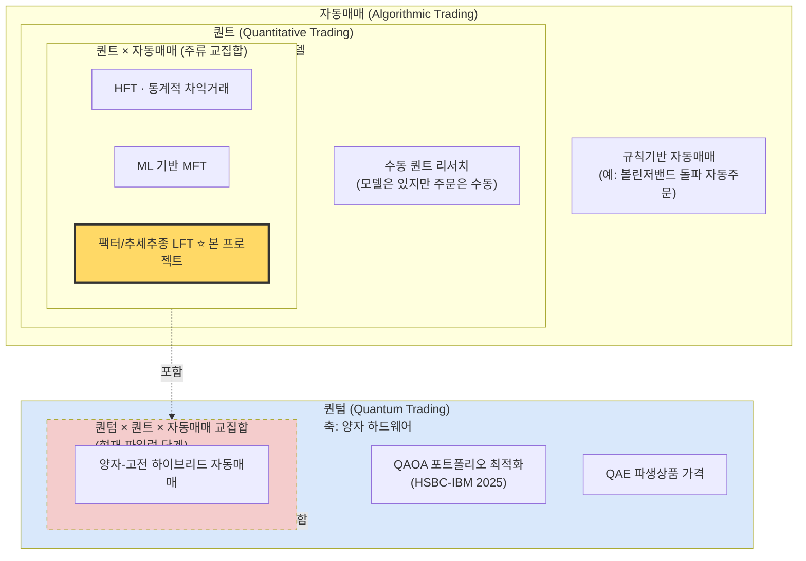

# 자동매매 / 퀀트 / 퀀텀 — 3자 관계와 본 프로젝트의 위치

> 작성일: 2026-04-13 | 이슈: #5 | 선행: #2, #3, #4

---

## 1. 3자 개념 정의 재확인

선행 문서(#2, #3, #4)의 결론을 압축하면 다음과 같다.

| 개념 | 정의 | 핵심 기준 | 성숙도 |
|------|------|-----------|--------|
| **자동매매(Algorithmic Trading)** | 사전 프로그래밍된 규칙으로 컴퓨터가 매수·매도를 자동 실행하는 방식 | "사람 개입 없이 주문이 나가는가" | 성숙 (1970s~) |
| **퀀트(Quantitative Trading)** | 수학·통계·ML 모델로 매매 신호를 생성하는 계량적 투자 | "의사결정이 수학 모델 기반인가" | 성숙 (1950s~) |
| **퀀텀(Quantum Trading)** | 양자컴퓨터(중첩·얽힘·QAOA·QAE 등)로 금융 문제를 가속 | "양자 하드웨어를 쓰는가" | 초기 파일럿 (2025 HSBC-IBM이 최초 실증) |

---

## 2. 3자 관계 다이어그램

세 개념은 **포함 관계가 아니라 교집합 관계**다. 서로 다른 축(실행 방식 / 신호 생성 방법 / 계산 하드웨어)을 가리키기 때문에 한 전략이 동시에 여러 범주에 속할 수 있다.

### 2.1 관계 요약

- **자동매매 ⊃ 퀀트 × 자동매매 교집합**: 현재 거래소 거래량의 약 80%가 이 교집합(퀀트+자동매매)에 속한다.
- **자동매매에 속하지 않는 퀀트**: 존재함 — 모델은 있으나 주문은 트레이더가 수동으로 내는 경우.
- **퀀트에 속하지 않는 자동매매**: 존재함 — 단순 조건식·지정가 자동 분할주문 등.
- **퀀텀**: 별개 축. 2026년 4월 기준 "완전 생산 배포 사례 0건", HSBC-IBM(2025.09)이 최초의 실제 데이터 실증. 상용화는 5~10년 후.
- **세 원의 교집합**: "양자 하드웨어를 사용해 계량 신호를 만들고 자동 주문으로 연결" — 현존하지 않는 영역.

---

## 3. 본 프로젝트의 정의 (1문장)

> **본 프로젝트 `quantum-trader-agent`는 "한국 개인투자자가 국내 증권사 Open API로 운용하는 저빈도(LFT) 규칙기반·퀀트 팩터 자동매매 에이전트"이며, 프로젝트명의 "quantum"은 브랜딩 표기일 뿐 양자컴퓨팅 기술과는 무관하다.**

이 정의는 선행 3개 문서의 결론을 종합한 것이다.

- #2 결론: "quantum-trader-agent는 퀀트 범주에 속하며, 양자컴퓨팅과는 무관하다."
- #3 결론: "2026년 현재 양자 트레이딩은 파일럿 단계, 개인투자자가 접근할 하드웨어·SDK 성숙도 부재."
- #4 결론: "한국 개인이 KIS/키움 API로 현실적으로 구현 가능한 영역은 저빈도(LFT)로 한정된다."

---

## 4. 이 정의가 설계·기술 선택에 주는 제약

| # | 제약 | 근거 | 설계 귀결 |
|---|------|------|-----------|
| C1 | **양자 하드웨어 미포함** | 정의상 "quantum"은 브랜딩; 양자 SDK 미성숙(#3) | Qiskit / D-Wave Ocean / PennyLane 등 양자 SDK 의존성 **전면 배제**. requirements.txt에 양자 라이브러리 금지 |
| C2 | **저빈도(LFT) 한정** | 국내 API는 REST 수십~수백ms 레이턴시, HFT 불가(#4) | FPGA/코로케이션/커널우회 NIC 불필요. **레이턴시 최적화 예산 0**. Python + 일반 VPS로 충분 |
| C3 | **한국 증권사 API 종속** | 대상 사용자: 한국 개인(#4) | 어댑터 계층은 **KIS REST/WebSocket + 키움 COM** 2종으로 한정. CCXT·IBKR 등 해외 브로커는 out-of-scope |
| C4 | **규칙·팩터 기반 전략** | LFT의 경쟁 우위는 속도가 아닌 알파 발굴(#4) | 신호 엔진은 백테스팅→모의투자→실전 단계 파이프라인 필수. ML은 선택, 실시간 딥러닝 추론 인프라는 불필요 |
| C5 | **KRX 규제 준수 필수** | 2023년 고속 알고리즘 사전 등록 의무(#4) | 초당 2건 / 일일 5,000건 주문 상한을 코드 레벨 **throttle**로 강제. 허수성 호가 방지 로직 내장 |
| C6 | **"퀀텀" 오해 방지 커뮤니케이션** | Koreafication 현상(#2), 마케팅 오용 사례 다수 | README / 문서 1페이지에 "양자컴퓨팅과 무관" 고지 필수. 배지·로고에 양자 모티프 사용 금지 |
| C7 | **개인투자자 자본 규모 전제** | $1K~ 수준 진입(#4) | 주문 수수료 최소화, 모의투자 계좌 우선 지원, 프리미엄 데이터 피드 의존 금지 |

---

## 5. 기술 스택 트레이드오프

| 옵션 | Pros | Cons | 채택 여부 |
|------|------|------|-----------|
| Python + KIS REST/WS | 플랫폼 독립, 공식 샘플, Claude/ChatGPT 연동 문서 존재 | Windows-only 키움 대비 일부 기능 제약 | **주 채택** |
| Python + 키움 Open API+ (PyQt5 COM) | 국내 레거시 사용자 다수, 안정성 검증 | Windows 전용, macOS/Linux CI 불가 | 보조 어댑터 |
| C++ / Rust 저지연 엔진 | 이론적 속도 우위 | LFT 요구사항 대비 과설계; C2 위반 | 기각 |
| Qiskit + IBM Quantum 통합 | 차별화 마케팅 | 정의상 범위 밖(C1), 유지보수 부담 | 기각 |

---

## 6. 출처 (선행 문서 요약 참조)

- **#2 terms-quant-vs-quantum**: Wikipedia(Quantitative analysis / HFT), Acadian Asset Management(Koreafication), CQF, 나무위키, GitHub quantum-trader, quantumtrading.com
- **#3 what-is-quantum-trading**: HSBC 공식 발표(2025.09.25), IBM Quantum Blog, The Quantum Insider(2026.03), Nature Scientific Reports, arXiv 2604.08180 / 2407.19857, Goldman Sachs Quantum Navigator
- **#4 what-is-algo-trading**: Wikipedia(Algorithmic Trading / HFT), QuantInsti Blog, KIS Developers Portal, 한국투자증권 GitHub, 키움 Open API+ 공식, 머니투데이(2023 고속 알고리즘 등록 의무화), 한국금융학회

전체 URL 목록은 선행 3개 문서의 "출처" 섹션 참조.
