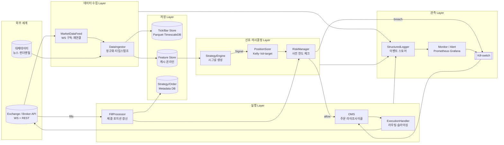

# 자동매매 시스템 구성요소 개괄

> 데이터 수집 → 저장 → 신호 → 주문 → 체결 → 리스크 → 로그 → 모니터링까지의 표준 파이프라인과 각 컴포넌트의 책임·인터페이스·실패 지점·복구 전략을 정리한다. 이후 구현 이슈의 뼈대가 되는 참조 아키텍처다.

---

## 1. 파이프라인 개관 (Mermaid)

---

## 2. 컴포넌트 책임 & 인터페이스

| 계층 | 컴포넌트 | 책임 | 핵심 인터페이스 (개념) |
|---|---|---|---|
| 수집 | `MarketDataFeed` | WebSocket 구독, heartbeat, 재연결, 순번(seq) 검증 | `subscribe(symbols)`, `on_tick(cb)`, `on_disconnect(cb)` |
| 수집 | `DataIngestor` | 정규화(OHLCV), 시간대 통일(UTC), idempotent write | `ingest(event) -> WriteResult` |
| 저장 | `TickStore` | 원시 tick·bar 보관, 시점 재생(replay) 지원 | `append(bar)`, `read(range, symbol)` |
| 저장 | `FeatureStore` | 피처 계산 캐시, 학습·추론 일관성(point-in-time) | `get(symbol, ts)`, `materialize(spec)` |
| 신호 | `StrategyEngine` | 전략 실행, `Signal{side, strength, ttl}` 생성 | `on_bar(ctx) -> Signal[]` |
| 신호 | `PositionSizer` | 자본·변동성 기반 수량 산출 | `size(signal, portfolio) -> qty` |
| 리스크 | `RiskManager` | 사전(pre-trade)·사후(post-trade) 한도, DD·VaR·노출 | `check(order)->Decision`, `on_fill(fill)` |
| 실행 | `OMS` | 주문 상태머신(NEW→ACK→PARTIAL→FILLED/CANCELED) | `submit(order)`, `cancel(id)`, `state(id)` |
| 실행 | `ExecutionHandler` | 거래소 어댑터, 레이트리밋, 재시도, idempotency-key | `place(order)->BrokerAck` |
| 실행 | `FillProcessor` | 체결 수신·포지션/PnL 갱신, 정합성 재확인 | `on_fill(fill)->PositionDelta` |
| 관측 | `StructuredLogger` | JSONL 이벤트 스트림, correlation-id 전파 | `emit(event)` |
| 관측 | `Monitor` | 지표 수집, SLO/알람, 대시보드 | `metric(name, value, tags)` |
| 관측 | `Kill-switch` | 전역 주문 정지·청산 모드 강제 | `trip(reason)`, `reset(token)` |

전체 시스템은 **이벤트 기반**(`MarketDataEvent → Signal → OrderIntent → Order → Fill → PositionUpdate`)으로 흐르며, 각 경계에서 **스키마 검증 + 상관ID(correlation_id) 전파**가 불변식이다.

---

## 3. 실패 지점·복구 전략 (FMEA)

| # | 실패 지점 | 원인 예시 | 탐지 | 1차 복구 | 2차 복구(안전 모드) |
|---|---|---|---|---|---|
| F1 | WS 단절·stale feed | 네트워크, 거래소 장애 | heartbeat 타임아웃, seq gap | 지수 backoff 재연결, REST 스냅샷 보간 | Kill-switch: 신규 진입 차단, 기존 포지션 flat |
| F2 | 중복/누락 틱 | At-least-once 전송 | idempotency key, seq 비교 | upsert, gap backfill | 해당 심볼 전략 일시 정지 |
| F3 | 클럭 드리프트 | NTP 실패 | `now - event_ts` 모니터 | NTP 재동기화 | 이벤트 폐기·경고 |
| F4 | 저장소 쓰기 실패 | 디스크·DB 장애 | write error 비율 | WAL·로컬 큐 버퍼링 | DB read-only mode, 전략 pause |
| F5 | 전략 예외 | 결측·NaN·버그 | try/except + metric | 해당 심볼 signal skip | 전략 격리(circuit-breaker) |
| F6 | 리스크 한도 초과 | DD, 레버리지, 집중도 | `RiskManager.check` | 주문 거부 | Kill-switch → 강제 청산 플레이북 |
| F7 | 주문 거절/에러 | 잔고·마진·파라미터 | broker reject code | 지수 backoff 재시도(idempotent) | 주문 경로 차단, manual override |
| F8 | 주문-체결 불일치 | 부분체결, 유실 | reconciler 주기 비교 | 상태 재조회 후 병합 | 포지션 freeze, 수동 확인 |
| F9 | 이중 실행(프로세스 2개) | 배포 실수 | 분산 락(lease) | 후발 인스턴스 자살 | 알람·수동 개입 |
| F10 | 관측 정전 | 로그 싱크 다운 | self-metric | 로컬 디스크 큐 | 운영자 페이지, 거래 보수화 |
| F11 | 모델 드리프트 | 분포 변화 | PSI/KS, 성과 저하 | 쉐도우 전략 롤백 | 전략 오프라인 |

설계 원칙: ① **idempotency**(모든 주문·쓰기), ② **at-least-once + dedupe**, ③ **fail-closed**(의심 시 주문 금지), ④ **state-machine 기반 OMS**, ⑤ **reconciler 주기 실행**, ⑥ **kill-switch 단일 진입점**.

---

## 4. 오픈소스 참조 구조

- **Zipline (Quantopian)** — 이벤트 드리븐 백테스터. `DataPortal`(데이터) + `TradingAlgorithm`(전략) + `Blotter`(주문) + `PerformanceTracker`(성과) 분리. 시뮬레이션 클럭이 모든 이벤트를 순서화한다. 라이브 거래는 제한적이며, 구조는 "데이터-전략-블로터-성과"의 4축이 본 문서의 수집/신호/실행/관측과 1:1 대응된다.
- **QuantConnect LEAN** — 백테스트와 라이브를 같은 코드로. `DataFeed`, `Algorithm`, `RiskManagement`, `Execution`, `Portfolio`, `Brokerage`로 계층 분리. `IBrokerage` 추상화로 거래소 어댑터 교체 가능. 본 설계의 `ExecutionHandler`·`RiskManager` 분리의 직접적 근거.
- **FinRL** — 강화학습용. `Environment`(시장/피처) + `Agent`(정책) + `Trade` 파이프라인. 실거래보다 학습·백테스트 중심. `StrategyEngine`을 RL 에이전트로 치환하는 플러그인 포인트를 보여준다.
- **공통 교훈**: (a) 데이터-전략-실행의 **경계 고정**, (b) **브로커 어댑터 추상화**, (c) 백테스트/라이브 **동일 인터페이스**, (d) 성과·리스크 모듈의 **1급 시민화**.

---

## 5. Phase 1 최소 구현 범위 (MVP)

목표: 단일 심볼·단일 전략·페이퍼 트레이딩으로 end-to-end 루프를 닫는다.

포함:
1. `MarketDataFeed` (1개 거래소 WS, 재연결·heartbeat만)
2. `DataIngestor` + `TickStore` (Parquet 파일 기반, 시간순 append)
3. `StrategyEngine` — 1개 룰 기반 전략(MA cross 등) + `Signal` 스키마
4. `PositionSizer` — 고정 비중 또는 변동성 타겟 단순화
5. `RiskManager` — pre-trade 한도(최대 포지션, 1일 손실), kill-switch on/off
6. `OMS` + `ExecutionHandler` — 페이퍼 브로커 어댑터, 상태머신, idempotency-key
7. `FillProcessor` — 체결 → 포지션/PnL 업데이트
8. `StructuredLogger` — JSONL + correlation-id
9. `Monitor` — 기본 지표(heartbeat, fill latency, PnL, DD), 콘솔/파일 대시보드

제외(Phase 2+): 멀티 거래소 라우팅, RL 에이전트, Feature Store 온라인화, 분산 실행, 실거래 브로커, 고급 리스크(VaR/CVaR), 자동 청산 플레이북.

수용 기준(요약): (a) WS 단절 후 자동 재연결 및 시세 공백 메트릭 기록, (b) pre-trade 한도 위반 시 주문 거부 로그·알람, (c) 페이퍼 체결 후 포지션·PnL 일치, (d) kill-switch 토글 시 신규 주문 0건.

---

## 6. 불변식(요약)

1. 외부 I/O 경계에서 모든 이벤트는 **스키마 검증 + correlation_id** 를 가진다.
2. 주문은 **idempotency-key** 없이는 발송되지 않는다.
3. `RiskManager`를 거치지 않은 주문은 `OMS`에 진입할 수 없다.
4. 모든 상태 변이(주문·포지션)는 **append-only 이벤트 로그**에 먼저 쓰인다(write-ahead).
5. Kill-switch는 **단일 진입점**이며, trip 후 reset은 명시 토큰을 요구한다.

---

## 출처

- Zipline 아키텍처 및 컴포넌트 구성 — https://zipline.ml4trading.io/ , https://github.com/stefan-jansen/zipline-reloaded
- QuantConnect LEAN 엔진 계층 구조 — https://www.lean.io/docs/v2/lean-engine/architecture , https://github.com/QuantConnect/Lean
- FinRL 프레임워크 구조 — https://github.com/AI4Finance-Foundation/FinRL , https://finrl.readthedocs.io/
- 주문 생명주기·OMS 상태머신(FIX 표준 참고) — https://www.fixtrading.org/standards/
- 이벤트 드리븐 트레이딩 시스템 설계 일반론 — Chan, E. P. "Algorithmic Trading" (2013); de Prado, M. L. "Advances in Financial Machine Learning" (2018) 5·15장(리스크·실행)
