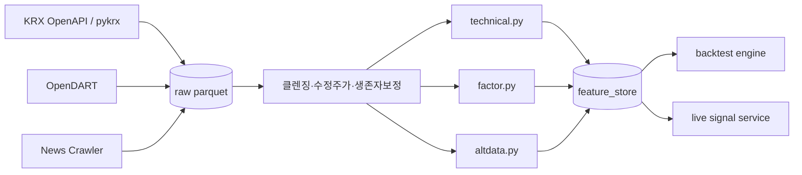

# 13. 피처·알파 소스 카탈로그 (Feature & Alpha Catalog)

> 전략 개발 초기 단계에서 공통적으로 끌어다 쓸 수 있는 "알파 유니버스"를 정의한다. 매번 새로 짜는 피처는 검증 부재·중복·룩어헤드 위험을 키운다. 본 문서는 (1) 기술지표 5종, (2) 팩터 4종, (3) 대체데이터 후보, (4) 한국 시장(KRX) 특이점, (5) 파이썬 스텁 시그니처를 정리한다.

## 0. 라이브러리 선택: pandas-ta vs TA-Lib vs 직접구현

| 항목 | TA-Lib | pandas-ta | 직접구현 (NumPy/Numba) |
|---|---|---|---|
| 설치 난이도 | C 빌드 필요 (Windows wheel/conda 권장) | `pip install pandas-ta` | 의존성 없음 |
| 지표 수 | ~150 | 130+ (Classic 200+) | 필요한 만큼 |
| 속도 | 매우 빠름 (C) | 중간 (벡터화 Pandas) | 빠름 (Numba JIT 시) |
| 룩어헤드 안전성 | 표준 구현 | 표준 구현, 일부 wrap에 차이 | 검증 필요 |
| 테스트 | 산업 표준, 레퍼런스 광범위 | 커뮤니티, 일부 버그 리포트 | 자체 책임 |

**결정 가이드**
- 초기 프로토타입·실험: `pandas-ta` (설치·체이닝 편리)
- 프로덕션·실시간: `TA-Lib` 또는 Numba 직접구현
- 중요 시그널(스토캐스틱·MACD 등)은 두 라이브러리 결과를 교차검증하여 일치 확인 후 채택

## 1. 기술지표 카테고리 (5종)

### 1.1 모멘텀 (Momentum)
- **RSI(14)**: 과매수/과매도 (70/30). 한국 시장은 변동성 높아 80/20 권장.
- **ROC(n)** = `close / close.shift(n) - 1`
- **MACD(12,26,9)**: 단기·중기 EMA 차이 + signal
- **Stochastic(14,3,3)**: 종가 위치 정규화

### 1.2 변동성 (Volatility)
- **ATR(14)**: True Range EMA. 포지션 사이징(켈리·역변동성 가중) 표준 입력.
- **Realized Vol(20)** = `log_returns.rolling(20).std() * sqrt(252)`
- **Garman-Klass / Yang-Zhang**: OHLC 기반 보다 정밀한 RV

### 1.3 추세 (Trend)
- **SMA/EMA(20,60,120)** + **골든/데드 크로스**
- **ADX(14)**: 추세 강도 (≥25 추세장)
- **Supertrend**: ATR 기반 추세 전환 시그널

### 1.4 밴드 (Bands)
- **Bollinger(20, 2σ)** + `%B`, `BandWidth`
- **Keltner Channel**: EMA ± k*ATR (Bollinger보다 매끄러움)
- **Donchian(n)**: 채널 돌파 = 터틀 시스템 기본

### 1.5 볼륨 (Volume)
- **OBV** (On-Balance Volume)
- **VWAP** (intraday, 한국 시장 9:00–15:30 기준 anchored)
- **MFI(14)** (가격+거래량 RSI)
- **체결강도 = 매수체결량 / 매도체결량** (KRX 호가 데이터 필요)

## 2. 팩터 카테고리 (4종) — 한국 시장 적용 주의점

| 팩터 | 정의 | KRX 주의점 |
|---|---|---|
| **가치(Value)** | E/P, B/P, FCF/EV, S/P | 분기 공시 지연 60일 룩어헤드 회피. 지주사 더블카운팅. **밸류업 프로그램(2024~)** 이후 PBR 0.8 이하 종목 리레이팅 발생 → 백테스트 구간 분할 필요. |
| **모멘텀(Momentum)** | 12-1M 수익률 | 단일 이벤트(공매도 재개 2024-06, 2025-03) 영향 큼. **공매도 금지 구간 별도 분석** 필수. |
| **퀄리티(Quality)** | ROE, ROIC, GrossProfit/Asset, Accruals | 재벌 그룹 내부거래 ROE 왜곡. 별도재무 ↔ 연결재무 혼용 금지. |
| **사이즈(Size)** | log(시가총액) | 코스피200 vs 코스닥150 분리. **유동성 필터(ADV 5억원 이상)** 필수 — 소형주 알파 대부분이 거래비용으로 소실. |

**공통 주의**
- 거래정지·관리종목·상폐 데이터 보존 (생존자편향 제거): KRX 통계월보·KIND 활용
- 액면분할/주식배당 조정 (수정주가) — pykrx의 `adjusted=True` 또는 자체 corporate-action 테이블
- 거래량 정규화: 단주거래제도(2014~) 이전 데이터는 별도 처리

## 3. 대체데이터(Alt-Data) 후보

| 데이터 | 출처 | 비용 | 갱신 | 활용 |
|---|---|---|---|---|
| 공매도 잔고 | KRX `short.krx.co.kr` / KRX Open API | 무료 | T+2 일 | 잔고 급증 → 하락 시그널, 숏스퀴즈 후보 |
| 뉴스 감성 | 네이버 뉴스 크롤, 한경/연합 RSS, FinBERT-ko | 무료~중 | 분 단위 | 이벤트 드리븐, 텍스트 임베딩 알파 |
| 체결강도/호가 | KRX 시세 API, 증권사 영웅문/HTS | 유료 (월 수만~수십만원) | 실시간 | 마이크로스트럭처, 단기 모멘텀 |
| 검색량 | Google Trends, 네이버 데이터랩 | 무료 | 일 | 리테일 관심도, 테마주 회전 |
| 외국인/기관 수급 | KRX 투자자별 매매동향 | 무료 | 일 | 한국 특화 강력한 알파, 익일 반영 |
| 공시(DART) | OpenDART API | 무료 | 실시간 | 이벤트, 지분변동, 자사주 |
| 신용잔고 | 금투협 | 무료 | 일 | 과열·반대매매 위험 |

## 4. KRX 데이터 접근 — 무료 경로

- **KRX Open API** (`openapi.krx.co.kr`, 2023~): 가입 후 무료 키. 일자별 시세·공매도잔고·투자자별·지수 제공.
- **pykrx** (오픈소스): KRX·NAVER 스크래핑 래퍼. 학습·백테스트 표준.
- **OpenDART** (`opendart.fss.or.kr`): 공시 원문·재무제표.
- **공공데이터포털**: KRX 상장종목정보, 금융위 데이터셋.

> 상용 옵션: FnGuide, KIS Datalink, Quantiwise (재무·컨센서스). 연 수백만원 수준.

## 5. 파이썬 스텁 시그니처

```python
# alpha_catalog/technical.py
from __future__ import annotations
import pandas as pd

def rsi(close: pd.Series, window: int = 14) -> pd.Series: ...
def atr(high: pd.Series, low: pd.Series, close: pd.Series, window: int = 14) -> pd.Series: ...
def macd(close: pd.Series, fast: int = 12, slow: int = 26, signal: int = 9) -> pd.DataFrame: ...
def bollinger(close: pd.Series, window: int = 20, n_std: float = 2.0) -> pd.DataFrame: ...
def vwap(price: pd.Series, volume: pd.Series, anchor: str = "session") -> pd.Series: ...
def realized_vol(close: pd.Series, window: int = 20, annualize: int = 252) -> pd.Series: ...
def adx(high: pd.Series, low: pd.Series, close: pd.Series, window: int = 14) -> pd.Series: ...

# alpha_catalog/factor.py
def value_score(financials: pd.DataFrame, *, ratios=("ep","bp","sp")) -> pd.Series: ...
def momentum(close: pd.DataFrame, lookback: int = 252, skip: int = 21) -> pd.DataFrame: ...
def quality_score(financials: pd.DataFrame, *, metrics=("roe","gpoa","accruals")) -> pd.Series: ...
def size_factor(market_cap: pd.DataFrame, *, log: bool = True) -> pd.DataFrame: ...

# alpha_catalog/altdata.py
def short_balance_ratio(ticker: str, start: str, end: str) -> pd.DataFrame: ...
def investor_flow(ticker: str, start: str, end: str,
                   actor: str = "foreign") -> pd.DataFrame: ...
def news_sentiment(ticker: str, start: str, end: str,
                    source: str = "naver", model: str = "finbert-ko") -> pd.DataFrame: ...
def search_trend(keyword: str, start: str, end: str,
                  provider: str = "naver_datalab") -> pd.DataFrame: ...

# alpha_catalog/utils.py
def lag(series: pd.Series, periods: int = 1) -> pd.Series:
    """룩어헤드 방지: 모든 피처는 사용 시점에 lag(1) 이상 필수."""
def winsorize(s: pd.Series, lower: float = 0.01, upper: float = 0.99) -> pd.Series: ...
def cs_zscore(df: pd.DataFrame) -> pd.DataFrame:
    """크로스섹션 z-score (팩터 표준 전처리)."""
def neutralize(factor: pd.DataFrame, exposures: pd.DataFrame) -> pd.DataFrame:
    """섹터·사이즈 중립화 (잔차 회귀)."""
```

## 6. 데이터 흐름



## 7. 체크리스트

- [ ] 모든 피처에 `lag(1)` 디폴트 강제 (룩어헤드 방지)
- [ ] 두 라이브러리(TA-Lib, pandas-ta) 결과 일치 단위테스트
- [ ] 생존자편향·corporate action 보정 데이터셋
- [ ] 공매도 금지 구간 플래그 (`is_short_banned`) 별도 컬럼
- [ ] 유동성 필터 (`ADV20 >= 5e8 KRW`) 디폴트 적용

## 관련 노트

- [[data-lake-schema]] — 본 카탈로그의 feature 출력이 저장될 parquet 스키마
- [[12-validation-protocol]] — 피처의 lag(1)·룩어헤드 방지 규칙
- [[rsi-divergence]] — RSI 기술지표의 실 구현 시그널
- [[momo-btc-v2]] — 모멘텀 팩터를 소비하는 전략 예시
- [[20-position-sizing]] — ATR·EWMA σ 가 vol targeting 입력으로 사용
- [[19-portfolio-risk]] — 팩터 노출 회귀·공분산 추정
- [[07-market-microstructure-basics]] — 공매도·수급 알트데이터 근거
- [[26-point-in-time-data]] — 수정주가·생존편향 방어 설계 (본 노트 §2 KRX 주의점 상세)
- [[27-corporate-actions]] — 액면분할·배당·유상증자 조정 프로토콜 (본 노트 §2 공통 주의사항 상세)
- [[30-market-regime-detection]] — ADX·EWMA σ·Hurst 를 체제 분류 입력으로 활용

## 출처

- pandas-ta 공식: https://www.pandas-ta.dev/ , https://pypi.org/project/pandas-ta/
- TA-Lib 비교: https://www.slingacademy.com/article/comparing-ta-lib-to-pandas-ta-which-one-to-choose/
- KRX Data Marketplace: https://data.krx.co.kr/
- KRX Open API: https://openapi.krx.co.kr/
- KRX 공매도 통계: https://short.krx.co.kr/
- pykrx (오픈소스 래퍼): https://github.com/sharebook-kr/pykrx
- KRX API 입문: https://bbangpower-blog.blogspot.com/2025/05/krx-api.html
- 공공데이터포털 KRX 상장종목: https://www.data.go.kr/data/15094775/openapi.do
- 한국 공매도 동향(2025): https://www.spglobal.com/market-intelligence/en/news-insights/research/2025/11/south-korean-short-interest-declines-amid-ai-driven-market-rally
- KOSPI 2025 회고: https://www.kedglobal.com/korean-stock-market/newsView/ked202512310004
- 한국 공매도·수익률 연구(2025): https://www.tandfonline.com/doi/full/10.1080/1226508X.2025.2588298
- 밸류업 인디케이터(KIND): https://kind.krx.co.kr/valueup/invstindicsectors.do?method=valueupInvstIndicRankIndMain
