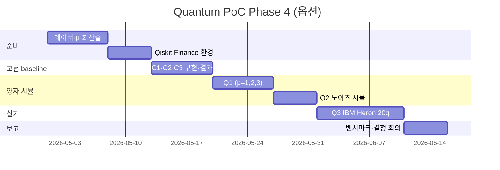

# 14. 양자 PoC 설계 — QAOA 포트폴리오 최적화 (Phase 4 옵션)

> 양자 컴포넌트는 메인 경로에서 제외(#5 결정)됐으나, 별도 트랙 PoC는 유지한다. 본 문서는 (1) 문제 정식화, (2) Qiskit Finance QAOA 50종목 벤치마크 설계, (3) 고전 baseline, (4) 성공·기각 기준, (5) IBM Quantum 비용 추정, (6) 일정·산출물을 정의한다.

## 1. 문제 정의 — 평균-분산 포트폴리오 (이진 선택)

전형적인 Markowitz 평균-분산 모델을 이산화한다:

```
maximize  μ^T x − q · x^T Σ x
subject to  1^T x = B   (정확히 B개 종목 선택)
            x ∈ {0,1}^n
```

- `n = 50`: 종목 수 = 큐비트 수 (1종목 = 1큐비트, one-hot 가장 단순)
- `B = 10`: 선택 종목 수 (제약은 페널티 항으로 흡수)
- `q`: 위험 회피 계수 (그리드 0.1, 0.5, 1.0)
- `μ`, `Σ`: KOSPI200 중 ADV·시총 상위 50종목 일간 수익률 1년 기반

Qiskit Finance `PortfolioOptimization` 클래스가 이 형식을 그대로 받는다. 변환 후 Ising Hamiltonian → QAOA 회로(Cost + Mixer × p layers)로 컴파일된다.

## 2. 실험 설계

### 2.1 데이터
- 기간: 2024-01-02 ~ 2024-12-30 (1년, 약 250 거래일)
- 유니버스: KOSPI200 ∩ ADV(20일) ≥ 10억원 ∈ 시총 상위 50
- 출처: pykrx, KRX OpenAPI
- 분할: 인샘플(2024 H1) 파라미터·튜닝 / 아웃샘플(2024 H2) 평가

### 2.2 알고리즘 매트릭스

| ID | 알고리즘 | 환경 | 큐비트 | 비고 |
|---|---|---|---|---|
| C1 | Markowitz QP | CVXPY (OSQP) | — | 연속 비중, baseline upper bound |
| C2 | 정수계획 (Gurobi/SCIP) | 고전 | — | 이산 baseline (정확해 또는 상한) |
| C3 | Simulated Annealing | 고전 | — | 휴리스틱 baseline |
| Q1 | QAOA p=1,2,3 | Qiskit Aer 시뮬 (StatevectorSampler) | 50 | 노이즈리스 |
| Q2 | QAOA p=2 | Aer + 노이즈모델(Heron 캘리브레이션) | 50 | 노이즈 영향 |
| Q3 | QAOA p=2 | IBM Heron r2 (실기) | 20 (축소) | 실기 검증 (50큐비트 회로 깊이 위험) |
| Q4 | SamplingVQE | Aer 시뮬 | 50 | 비교군 |

> 50큐비트 실기 풀스케일은 회로 깊이/노이즈로 의미 없는 결과 가능성 큼 → Q3는 20종목 축소판으로 실측, 나머지는 시뮬레이터 위주.

### 2.3 평가 지표

1. **솔루션 품질**: 목적함수 값 / C2(정확해) 비율 (Approximation Ratio, AR)
2. **포트폴리오 성과**: 아웃샘플 Sharpe, MDD, Turnover
3. **계산 시간**: wall-clock (고전 vs QPU 큐 대기 포함)
4. **회로 통계**: depth, two-qubit gate count, transpile time

## 3. 고전 Baseline 상세

```python
# C1: Markowitz QP (연속)
import cvxpy as cp
w = cp.Variable(n, nonneg=True)
prob = cp.Problem(cp.Maximize(mu @ w - q * cp.quad_form(w, Sigma)),
                   [cp.sum(w) == 1])
prob.solve(solver=cp.OSQP)

# C2: 0-1 정수 (정확해 / 상한)
x = cp.Variable(n, boolean=True)
prob = cp.Problem(cp.Maximize(mu @ x - q * cp.quad_form(x, Sigma)),
                   [cp.sum(x) == B])
prob.solve(solver=cp.SCIP)
```

## 4. 성공 지표 / 기각 기준 (각 1문장)

- **성공 지표**: 노이즈리스 시뮬 Q1(p≥2)이 SA(C3) 대비 동등 이상의 AR(≥0.95) 달성, 그리고 실기 Q3가 SA 대비 AR ≥ 0.85 달성.
- **기각 기준**: 실기 Q3의 AR이 0.7 미만이거나, QAOA wall-clock(QPU 대기 포함)이 정수계획 C2의 100배를 초과하면 NISQ 단계에서는 비효율로 판정해 PoC 종료.

## 5. IBM Quantum 비용 추정 (2025년 4분기 기준)

IBM Quantum 가격은 초 단위 과금이며, 공개된 일반 범위로 큐비트 초당 약 $0.01~$1 수준이다. Heron 계열은 Premium/Pay-as-you-go에서 $1.60/sec 내외의 단가가 보고된 사례가 있다.

| 항목 | 단가 가정 | 사용량 가정 | 소계 |
|---|---|---|---|
| 시뮬 (Aer, 자체 GPU) | 무료 | 200 회로 × 8192 shots | $0 |
| 노이즈 시뮬 | 무료 | 50 회로 × 8192 shots | $0 |
| Heron 실기 (Q3, 20큐비트) | $1.60/sec | 회로 1~3sec × 8192 shots × 50 회로 ≈ 2,500 sec | ≈ $4,000 |
| 큐 대기·트랜스파일 오버헤드 | — | 30% 버퍼 | ≈ $1,200 |
| **합계** | | | **≈ $5,000–$6,000** |

> Open Plan(무료, 월 10분) 사용 시 외부 비용 0이지만, 50큐비트 실험에는 시간이 부족. 학술 협력(IBM Quantum Network) 또는 Premium 단기 구독 검토.

## 6. 회로/하드웨어 선택

| 옵션 | 추천 시점 |
|---|---|
| `qiskit-aer` Statevector | 50큐비트 노이즈리스, 메모리 ≤ 32GB 지원 |
| `qiskit-aer` Density Matrix + Heron 노이즈모델 | 노이즈 시뮬 |
| IBM Heron r2 (133q, 156q) | 실기 — 깊이가 얕은 회로(p≤2) 권장 |
| IBM Eagle (127q) | 비용 절감 시 차선 |

## 7. 일정 (8주)



## 8. NISQ 한계 — 명시 사항

- 게이트 노이즈로 p≥3 회로는 신호가 노이즈에 묻힘
- 큐 대기시간 수십 분~수 시간 → 일중 운용 불가
- 에러 완화(M3, ZNE)는 회로/스팟 비용을 증가시킴
- 50큐비트 풀이는 현 시점에서 광고용 시연 수준이며, 실거래 우위 입증은 불가능 — 본 PoC 목적은 "기술 학습/측정"이지 실전 채택 아님

## 9. 산출물

- `scripts/quantum_poc/` (data prep, classical, qaoa, plots)
- `notebooks/poc/portfolio_qaoa_50.ipynb`
- `docs/background/14-quantum-poc-design.md` (본 문서)
- `docs/work/done/000029-quantum-poc/` 결과 보고

## 10. 데이터 흐름

```mermaid
flowchart LR
    KRX[(KRX OpenAPI / pykrx)] --> RET[일간수익률]
    RET --> MU[μ 추정]
    RET --> SIG[Σ 추정 (Ledoit-Wolf shrink)]
    MU --> POP[PortfolioOptimization]
    SIG --> POP
    POP --> QP[QuadraticProgram]
    QP --> IS[Ising Hamiltonian]
    QP --> CLS[CVXPY/SCIP/SA]
    IS --> QAOA[QAOA p=1..3]
    QAOA --> AER[Aer 시뮬]
    QAOA --> HER[IBM Heron]
    CLS --> EVAL[성과 평가]
    AER --> EVAL
    HER --> EVAL
```

## 출처

- Qiskit Finance Portfolio Optimization Tutorial: https://qiskit-community.github.io/qiskit-finance/tutorials/01_portfolio_optimization.html
- Qiskit Finance GitHub: https://github.com/qiskit-community/qiskit-finance
- IBM Quantum Pricing & Access Plans: https://www.ibm.com/quantum/products
- IBM Quantum Hardware Roadmap: https://www.ibm.com/quantum/hardware
- IBM Heron vs Eagle 가격·성능 비교: https://quantumcomputer.blog/ibm-heron-chip-price-revisions-heron-vs-eagle/
- IBM Heron (Wikipedia): https://en.wikipedia.org/wiki/IBM_Heron
- IBM Quantum Q3 2025 Update: https://www.ibm.com/quantum/blog/whats-new-q3-2025
- Quantum Portfolio Optimization Extensive Benchmark (2025): https://arxiv.org/html/2509.17876v1
- Q-PORT Resource-Efficient Encoding (2025): https://link.springer.com/chapter/10.1007/978-3-032-13852-1_34
- Higher-Order Portfolio Optimization HUBO QAOA (QCE25): https://zbjob.github.io/QCE25-HUBO-QAOA.pdf
- Best practices for portfolio optimization on real devices (Sci Reports 2023): https://www.nature.com/articles/s41598-023-45392-w
- 50-Qubit FPC-QAOA on IBM Kingston: https://quantumzeitgeist.com/quantum-optimization-qaoa-nisq-advances-scalable-qubit-hardware/
- Qiskit Function — Quantum Portfolio Optimizer (Global Data Quantum): https://quantum.cloud.ibm.com/docs/en/tutorials/global-data-quantum-optimizer
- Quantum Computing Cost Overview (PatentPC): https://patentpc.com/blog/the-cost-of-quantum-computing-how-expensive-is-it-to-run-a-quantum-system-stats-inside
