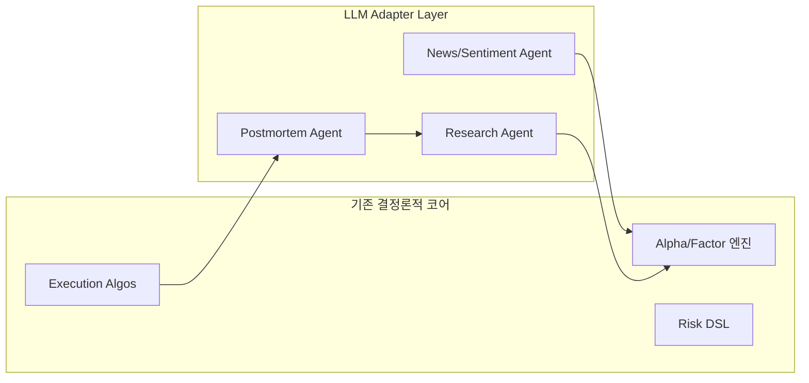
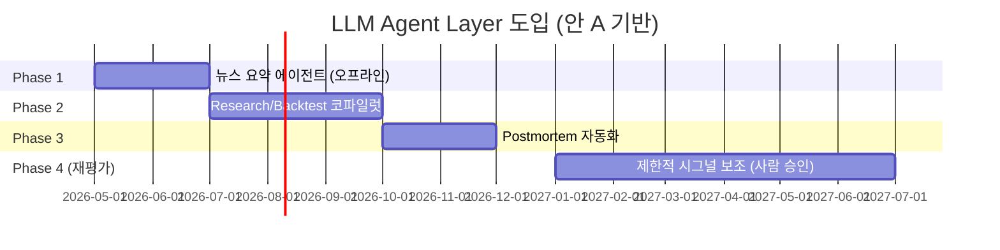

# 15. LLM 에이전트 레이어 탐색 — Agentic Trading

> 2024~2025년에 부상한 "Agentic Trading" 아키텍처를 본 프로젝트에 결합할 가치가 있는지 검토한다. (1) 문헌 5건 요약, (2) 결합 방식 2안 (adapter / replacement), (3) 리스크 평가, (4) 결론을 정리한다.

## 1. 문헌 조사 (5건+)

| # | 제목 | 저자/조직 | 핵심 |
|---|---|---|---|
| 1 | **TradingAgents: Multi-Agents LLM Financial Trading Framework** (arXiv:2412.20138, 2024-12, v7 2025-06) | Xiao, Sun, Luo, Wang (Tauric Research) | LangGraph 기반 7역할(Fundamentals/Sentiment/News/Technical/Researcher/Trader/Risk Manager). 토론형 디베이트 구조. |
| 2 | **Orchestration Framework for Financial Agents (FinAgent)** (arXiv:2512.02227, 2025) | Libertify | 9 에이전트(Planner/Orchestrator/Data/Alpha/Risk/Portfolio/Backtest/Execution/Memory). 알고-트레이딩 컴포넌트와 1:1 매핑. BTC 분봉에서 BHL 대비 Sharpe 0.378 vs 0.170 보고. |
| 3 | **FinAgent: Multimodal Foundation Agent for Financial Trading** (arXiv:2402.18485 v3) | AI4Finance | GPT-4v로 K차트·트레이딩차트 시각 입력 + 텍스트·수치 통합. 도구 증강. |
| 4 | **AlphaAgents: Multi-Agent LLM for Equity Portfolios** (arXiv:2508.11152, 2025-08) | — | 주식 포트폴리오용 다중 에이전트, 종목별 분석 → 합의 형성 워크플로. |
| 5 | **TradingGroup: Multi-Agent Trading System with Self-Reflection and Data-Synthesis** (arXiv:2508.17565, 2025-08) | — | 자기반영 루프, 합성 데이터로 미세조정. |
| 6 | **Survey: LLM Agent in Financial Trading** (arXiv:2408.06361, 2024) | — | 관련 연구 분류·메타분석. 반영형/디베이트형/도구증강형 카테고리. |
| 7 | **FinGPT** (arXiv:2306.06031) | AI4Finance | 오픈소스 금융 LLM, LoRA 50K 샘플 파인튜닝. 본 프로젝트의 도메인 모델 옵션. |

> 공통 패턴: ① 역할분리(Analyst/Trader/Risk) ② 디베이트·반영 루프 ③ 도구 증강(시세·뉴스·차트) ④ 메모리 에이전트로 장기 학습.

## 2. 본 프로젝트와의 결합 방식 (2안)

### 2.1 안 A — Adapter (보조 레이어)

- **역할**: LLM은 *입력*만 보강 (뉴스 요약, 리포트 발굴, 사후 분석)하며 *주문 결정에는 직접 개입하지 않음*.
- **장점**: 결정론적 시스템 무결성 유지, 환각이 주문으로 직결되지 않음.
- **단점**: LLM이 "생산성 도구"에 머묾 — 아키텍처 혁신은 적음.
- **결합 비용**: 작음 (별도 마이크로서비스, 큐 기반).

### 2.2 안 B — Replacement (코어 대체)

기존 룰 기반 Planner/Trader/Risk 모듈을 LLM 에이전트(TradingAgents/FinAgent 형태)로 교체.

- **장점**: 자연어 전략 명세, 새로운 알파 자동 탐색.
- **단점**: 환각·레이턴시·비결정성이 *주문 경로*에 들어옴 → 회계·컴플라이언스·검증 모두 재설계 필요.
- **결합 비용**: 매우 큼 (오케스트레이션·관측·KPI 전면 재정의).

> **권고: 안 A**. 안 B는 본 프로젝트 단일팀 규모/리스크 수용범위 초과.

## 3. 리스크 평가표

| 리스크 | 영향 | 발생 가능성 | 안 A 노출 | 안 B 노출 | 완화 전략 |
|---|---|---|---|---|---|
| **Hallucination** (사실 오류로 잘못된 시그널) | 심각 (오주문/손실) | 높음 (15~38% 보고) | 중 (입력측만, 사람·룰이 거름) | 매우 높음 | RAG·근거첨부·디베이트·confidence threshold |
| **Latency** (LLM 호출 200ms~수초) | 중~심각 (단기 전략) | 항상 | 낮음 (오프라인/배치) | 매우 높음 | 캐시·작은 모델·로컬 추론·비실시간 경로만 사용 |
| **Determinism** (동일 입력 ≠ 동일 출력) | 심각 (재현 불가) | 항상 | 낮음 (사람 검토 단계) | 매우 높음 | seed 고정·tool-call only·구조화 출력·temperature=0 |
| **Cost** (토큰비용 폭주) | 중 | 보통 | 낮음 | 높음 | budget cap·티켓당 토큰 한도·모델 라우팅 |
| **Prompt Injection** (외부 뉴스로 조작) | 심각 | 보통 | 중 (뉴스 입력) | 높음 | input sanitization·tool whitelist·sandbox |
| **규제·감사** (설명가능성 부족) | 심각 (한국 자본시장법) | 항상 | 낮음 | 매우 높음 | 모든 LLM 결정 로그·근거 저장·사람 승인 게이트 |
| **모델 드리프트** (제공자 모델 업데이트) | 중 | 보통 | 중 | 높음 | 버전 핀·회귀 테스트 스위트 |

## 4. 결론 (1문장)

> **결론: "포함하되 보조 레이어(안 A)로 후순위." Phase 1~3 동안에는 결정론적 코어를 우선 안정화하고, LLM은 (a) 뉴스/리서치 요약 (b) 사후 분석 (c) 운영 코파일럿에 한정 도입하며, 주문 경로 직결(안 B)은 규제·검증 체계가 마련되기 전까지 배제한다.**

## 5. 단계별 도입 로드맵

## 6. 채택 시 가이드레일

1. **주문 경로 진입 금지**: LLM 출력은 사람 검토 또는 룰 게이트를 통과해야만 주문 흐름에 진입.
2. **구조화 출력**: 모든 LLM 호출은 JSON Schema 강제 (`response_format`), 자유서술 금지.
3. **근거 첨부**: RAG로 인용 ID 첨부, 근거 없는 주장은 거절.
4. **레이턴시 SLO**: 코파일럿 < 5s p95, 비실시간 배치 < 5min.
5. **비용 SLO**: 일일 토큰비용 한도 (예: $30/day) 자동차단.
6. **버전 핀·회귀 스위트**: 모델·프롬프트 변경 시 골든 케이스 50건 회귀.
7. **감사 로그**: 입력·도구호출·출력·근거를 90일 이상 보존.

## 출처

- TradingAgents (arXiv): https://arxiv.org/abs/2412.20138
- TradingAgents GitHub: https://github.com/TauricResearch/TradingAgents
- TradingAgents 사이트: https://tradingagents-ai.github.io/
- FinAgent Orchestration Framework: https://arxiv.org/html/2512.02227v1
- Libertify FinAgent 해설: https://www.libertify.com/interactive-library/financial-agents-orchestration-framework-agentic-trading/
- FinAgent Multimodal: https://arxiv.org/html/2402.18485v3
- AlphaAgents: https://www.emergentmind.com/papers/2508.11152
- TradingGroup: https://arxiv.org/html/2508.17565
- LLM Agent in Financial Trading Survey: https://arxiv.org/html/2408.06361
- FinGPT (arXiv): https://arxiv.org/abs/2306.06031
- FinGPT GitHub: https://github.com/AI4Finance-Foundation/FinGPT
- LLM Hallucinations in Financial Services (Chainlink): https://blog.chain.link/the-trust-dilemma/
- LLM Hallucinations 금융기관 시사점 (BizTech 2025): https://biztechmagazine.com/article/2025/08/llm-hallucinations-what-are-implications-financial-institutions
- Overcoming LLM Hallucinations (AWS 2025): https://aws.amazon.com/blogs/machine-learning/overcoming-llm-hallucinations-in-regulated-industries-artificial-geniuss-deterministic-models-on-amazon-nova/
- LLM Observability (Splunk): https://www.splunk.com/en_us/blog/learn/llm-observability.html
- Mitigating LLM Hallucinations Review (2025-05): https://www.preprints.org/manuscript/202505.1955
