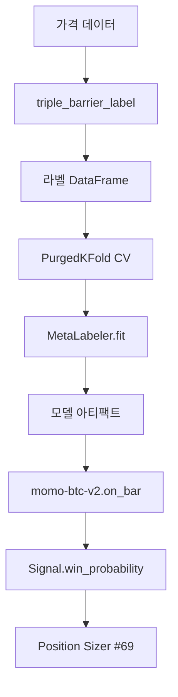

## 1. 목적 · 배경

규칙 기반 전략(예: `momo-btc-v2`)은 진입 신호의 방향(side)은 잘 잡지만 false positive가 많다. 메타라벨링은 1차 전략 신호를 그대로 유지하면서 "이 트레이드를 실제로 잡을지" 여부를 2차 이진 분류기(LightGBM)로 결정한다 (López de Prado, AFML Ch.3).

**왜 메타라벨링인가:**
- 1차 전략 방향 예측과 포지션 사이징(크기) 결정을 분리 → 각각 독립적으로 개선 가능
- Precision 향상 집중 — 이미 방향이 정해진 신호 중 승률 높은 것만 선별
- `win_probability` 를 position sizer (#69)가 직접 소비 → 사이징과 메타라벨링 자연 연동

## 2. 인터페이스

### 2.1 `triple_barrier_label`

```python
from src.ml.labeling import triple_barrier_label

result = triple_barrier_label(
    prices: pd.Series,       # close price, DatetimeIndex
    events: pd.DataFrame,    # index=entry_ts, cols=[side:int{+1,-1}, t1:datetime]
    tp: pd.Series | float,   # 익절 폭 (가격 대비 비율)
    sl: pd.Series | float,   # 손절 폭 (양수)
    costs_bps: float = 0.0,  # 라운드트립 거래비용 (bps)
) -> pd.DataFrame
# 반환 컬럼: label:int{0,1}, ret:float, barrier:str{'tp','sl','t1'}, t_touch:datetime
```

**불변식:** `t_touch > entry_ts` 엄격 부등식 (룩어헤드 금지)

### 2.2 `PurgedKFold`

```python
from src.ml.cv import PurgedKFold

cv = PurgedKFold(n_splits=5, embargo_frac=0.01)
for train_idx, test_idx in cv.split(X, t1=labels["t_touch"]):
    ...
```

- `t1`: 각 샘플의 라벨 확정 시점 (`triple_barrier_label` 의 `t_touch`)
- purge: test fold 시점과 겹치는 train 샘플 제거
- embargo: test fold 직후 `embargo_frac * N` 구간을 train에서 배제

### 2.3 `MetaLabeler`

```python
from src.ml.meta_labeler import MetaLabeler, MetaLabelerConfig

cfg = MetaLabelerConfig(random_state=42)   # 결정적 학습
ml = MetaLabeler(cfg)
ml.fit(X_train, y_train, X_val, y_val)    # early stopping 지원

proba = ml.predict_proba(X)               # shape (N, 2)
p_win = ml.win_probability(X)             # = proba[:, 1], 후처리 없음

ml.save(Path("models/momo-btc-v2/20260424-120000/"))
ml2 = MetaLabeler.load(Path("models/momo-btc-v2/20260424-120000/"))
```

**불변식:**
- `deterministic=True`, `force_col_wise=True` — Windows 환경 재현성
- `win_probability` = `predict_proba[:, 1]` 직접 매핑, 캘리브레이션 없음

### 2.4 `WalkForwardSplitter`

```python
from src.ml.walkforward import WalkForwardSplitter, WalkForwardConfig

cfg = WalkForwardConfig(mode="expanding", train_window=500, test_window=100, step=100)
wf = WalkForwardSplitter(cfg)
for train_idx, test_idx in wf.split(index):
    ...
```

## 3. 학습 파이프라인



## 4. 피처 카탈로그

`[[13-feature-alpha-catalog]]` 에 등록된 알파 팩터 레지스트리 값 + 신호 메타(side, divergence_magnitude, confidence)를 피처로 사용한다.

## 5. CV 프로토콜

`[[22-validation-protocol]]` 기준 준수. Purged K-fold + embargo로 시계열 리키지 방지.

## 6. 아티팩트 레이아웃

```
models/<strategy_id>/<YYYYMMDD-HHMMSS>/
├── model.lgbm          # LightGBM booster
└── manifest.json       # git_sha, feature_names, config, trained_at
```

`models/` 전체는 `.gitignore` 적용 — 실 아티팩트는 CI/별도 저장소.

## 7. 전략 통합 가이드

```python
from src.ml.meta_labeler import MetaLabeler

# 전략 생성 시 주입 (metalabeler=None 기본값 → 기존 bypass 회귀 없음)
strategy = MomoBtcV2(metalabeler=MetaLabeler.load(model_dir), metalabeler_threshold=0.5)
```

on_bar 내부 훅 포인트: Signal 생성 직전에서 `win_probability` 임계값 미달 시 `action="hold"` 반환.

## 8. 실패 모드 · 롤백 기준

| 상황 | 대응 |
|------|------|
| CV accuracy < 0.55 | MetaLabeler 배치 금지, 원인 분석 기록 |
| on Sharpe < off Sharpe + 0.2 AND on MDD > off MDD - 10%p | 해당 전략 disable 유지 |
| Windows 재현성 깨짐 | `force_col_wise=True`, `num_threads=1` 추가 |
| 모델 아티팩트 커밋 사고 | `.gitignore` `models/**` 재확인 |
